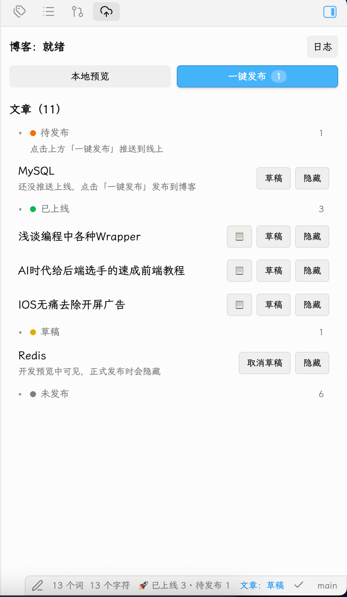

# Obsidian Blog Publisher

完全可定制的博客发布工具 — 支持任意静态站点生成器，Manifest 驱动的自动清理，实时预览和构建日志。

<p align="center">
  
  
  
</p>

<!-- 截图待补，要点见 docs/README.md。把图放进 docs/ 后取消下面的注释。
<p align="center">
  
</p>
-->

## 为什么需要这个插件？

你改了文章标题，博客里出现两个 URL（旧的和新的）。  
你删了一篇文章，文件还留在仓库里。  
你点了发布，不知道成功没，要切到终端看日志。

**这个插件解决了这三个问题。**

### 别的插件为什么做不到？

大多数 Obsidian 发布插件是「导出器」：把 markdown 复制到仓库，构建交给你。问题是：

- ❌ 你改了 `title`（slug 变了），旧文件不会删
- ❌ 你取消发布，文件还在站点里
- ❌ 构建在终端跑，你看不到进度
- ❌ 框架硬编码（只支持 Jekyll/Hugo/它自己的模板）

**这个插件不是导出器，而是构建系统驱动器：**

- ✅ 调用**你自己的**构建脚本（不限框架、不限语言）
- ✅ 用 **manifest** 记录产出，下次同步时自动清理旧文件
- ✅ 实时日志在 Obsidian 里流式显示
- ✅ 支持任意框架（Astro/Hugo/Hexo/Jekyll/自定义）
- ✅ 支持任意运行时（Bun/npm/pnpm/yarn/Ruby/Go/Python...）

## 对比其他插件

| 需求 | Digital Garden | GitHub Publisher | Static Site MD Exporter | **Blog Publisher** |
|------|----------------|------------------|------------------------|-------------------|
| 支持自定义框架 | ❌ 只支持自己的模板 | ⚠️ 只支持 Jekyll/Hugo | ⚠️ 只支持 Hugo/Hexo | ✅ 任意框架 |
| 自动清理旧文件 | ⚠️ 需要配置 | ❌ 要手动删 | ❌ 要手动删 | ✅ Manifest 自动清理 |
| 实时预览 | ✅ 有 | ❌ 没有 | ❌ 没有 | ✅ 有 |
| 构建日志可见 | ⚠️ 只看到结果 | ❌ 在终端 | ⚠️ 只看到结果 | ✅ 实时流式日志 |
| 自定义命令 | ❌ 硬编码 | ❌ 硬编码 | ❌ 硬编码 | ✅ 六个命令都能改 |
| 自定义运行时 | ❌ 只支持 Node | ❌ 只支持 npm | ❌ 只支持 Node | ✅ Bun/npm/pnpm/yarn/任意 |
| 自定义校验规则 | ❌ 硬编码 | ❌ 硬编码 | ❌ 硬编码 | ✅ 用 JS 写 |

## 适合谁用？

✅ 你有自己的博客仓库（Astro/Hugo/Hexo/Eleventy/Jekyll/自己写的）  
✅ 你的构建脚本能输出一行 JSON 结果（[协议文档](PROTOCOL.md)）  
✅ 你想在 Obsidian 里管理博客，而不是切来切去

❌ 你想要"点一下就有网站" → 用 [Digital Garden](https://github.com/oleeskild/obsidian-digital-garden)  
❌ 你不想写构建脚本 → 用 [GitHub Publisher](https://github.com/ObsidianPublisher/obsidian-github-publisher)

## 核心特性

### 🗑️ Manifest 驱动的自动清理
改了文章标题（slug 变了）？取消发布？删了文章？  
站点里的旧文件自动清理，不留垃圾。

**工作原理：** 每次同步后记录产出的文件列表（manifest），下次同步时对比差异，自动删除不该留的文件。

### 📺 实时预览 + 构建日志
在 Obsidian 里启动开发服务器，日志分类显示（info/error），端口自动探测。  
不用切到终端看构建进度，退出码非 0 立即中断并告诉你哪一步失败。

### ⚙️ 完全可定制
- **任意命令** — 六个阶段的命令都能改：install / sync / build / publish / dev / preview
- **任意运行时** — Bun / npm / pnpm / yarn / Ruby / Go / Python / 任意可执行文件
- **任意校验** — 用 JavaScript 写校验规则，或留空只检查 `publish` 字段
- **任意框架** — 只要能输出一行 JSON 结果，就能集成（[协议文档](PROTOCOL.md)）

### 🎯 智能状态管理
文章按「可发布 / 草稿 / 需检查 / 未同步」分组显示，可内联切换状态。  
框架自动识别（Astro/Hugo/Hexo/Jekyll），一键套用预设命令。

## 架构

```
Plugin (Obsidian API)
  ↓
Task Runner (State Machine)
  ↓
Runtime Abstraction (Bun/npm/pnpm/yarn/custom)
  ↓
User's Build Scripts
  ↓
Manifest (JSON)
  ↓
Cleanup Logic
```

**关键设计：**
- **运行时抽象** — 自动探测 Bun/npm/pnpm/yarn，或使用自定义可执行文件
- **状态机** — installing → syncing → building → previewing → publishing，每个阶段独立可配
- **协议驱动** — 构建脚本输出一行 JSON：`__BLOG_RESULT__{"published":[],"removed":[],"slugs":{}}`
- **Manifest 对比** — 记录上次产出，下次同步时计算 diff，删除不该留的文件

详见 [PROTOCOL.md](PROTOCOL.md) 和 [ARCHITECTURE.md](ARCHITECTURE.md)（施工中）。

## 插件会改动 vault 里的什么

**只有 frontmatter，只有这些字段，只在你主动操作时：**

| 字段 | 何时写入 | 说明 |
|------|----------|------|
| `publish` | 你点「发布」/「取消发布」 | `true` 才会同步到站点 |
| `draft` | 你点「转为草稿」/「转为正式」 | 开发预览可见，生产构建隐藏 |

笔记正文永远不会被修改。slug 由同步脚本计算，写在站点仓库里，不回写 vault。

## Manifest 清理原理

这是插件的核心优势。别的插件只管「复制文件到仓库」，不管「删除不该留的文件」，导致：

- 改了文章 `title`（slug 变了）→ 旧 URL 和新 URL 同时存在
- 取消发布或删了文章 → 文件还在站点里
- 改了 Jekyll 的 `publishDate`（文件名前缀变了）→ 两个日期的文件都在

**Manifest 如何工作：**

```typescript
// 每次同步后，构建脚本输出一行 JSON：
__BLOG_RESULT__{"published":["post1.md","post2.md"],"slugs":{"blog/post1.md":"hello-world","blog/post2.md":"second"}}

// 插件解析后保存到 data.json：
{
  "lastManifest": {
    "blog/post1.md": "/blog/hello-world",
    "blog/post2.md": "/blog/second"
  }
}

// 下次同步时，对比新旧 manifest：
const removed = oldFiles.filter(f => !newFiles.includes(f))
// → ["/blog/old-slug"]  ← 这是 post1.md 改标题前的旧 URL

// 构建脚本收到 removed 列表，执行删除：
for (const file of removed) {
  await fs.unlink(path.join(contentDir, file))
}
```

**效果：** 改一次标题，插件自动清理旧文件。你的站点永远只有当前版本，不留历史垃圾。

详细协议见 [PROTOCOL.md](PROTOCOL.md)。四个框架示例（[examples/](examples/)）都实现了这套逻辑，可直接复制。

## 输出协议

构建脚本需要输出一行结构化结果（默认前缀 `__BLOG_RESULT__`）：

```
__BLOG_RESULT__{"initialized":[],"published":["post1.md"],"removed":[],"slugs":{"blog/post1.md":"hello-world"}}
```

详见 [PROTOCOL.md](PROTOCOL.md)。

### 手动安装

1. 从 [Releases](https://github.com/Chlx42/obsidian-blog-publisher/releases) 下载最新版本
2. 解压到 `.obsidian/plugins/blog-publisher/`
3. 在 Obsidian 设置 → 第三方插件 → 启用「Blog Publisher」

### 社区插件市场

即将提交。目前可通过手动安装或 [BRAT](https://github.com/TfTHacker/obsidian42-brat) 使用。

## 快速开始

### 前置条件

- Obsidian 1.5.0+
- 已有博客项目和构建脚本（任意框架、任意运行时）
- 运行时：Bun / npm / pnpm / yarn / 或任意可执行文件
- 构建脚本能输出一行 JSON（[协议文档](PROTOCOL.md)）

### Astro 项目（开箱即用）

插件默认预设是 Astro + Bun，配置最简单。完整示例见 [examples/astro/](examples/astro/)。

**集成步骤：**

1. **复制同步脚本**

   ```bash
   cp -r examples/astro/scripts/blog/ <你的项目>/scripts/
   ```

2. **添加 npm scripts**

   ```json
   {
     "scripts": {
       "blog": "bun run scripts/blog/cli.ts sync",
       "blog:build": "bun run scripts/blog/cli.ts build",
       "blog:publish": "bun run scripts/blog/cli.ts publish"
     }
   }
   ```

3. **配置插件**
   - 博客仓库路径：Astro 项目的绝对路径
   - 文章文件夹：`blog`（vault 内相对路径）
   - 包管理器：Bun
   - 其余保持默认

4. **开始使用**
   - 点击侧边栏博客图标打开面板
   - 点击「预览」启动开发服务器
   - 在 Obsidian 里改文章，保存后自动同步
   - 点击「发布」推送到 git

### 其他框架

每个示例都实现了完整的 manifest 清理逻辑：

- **[Hugo](examples/hugo/)** — Node 标准库，零第三方依赖
  - 处理 TOML frontmatter 转换
  - 演示自定义命令配置

- **[Hexo](examples/hexo/)** — 串联 Hexo 自己的 generate/deploy
  - 适配 Hexo 的发布流程
  - 展示如何集成已有构建命令

- **[Jekyll](examples/jekyll/)** — 同步脚本用 Node，构建交给 bundle
  - 处理日期前缀文件名（`YYYY-MM-DD-slug.md`）
  - 改 `publishDate` 后自动重命名并删旧文件

**改 slug 不留垃圾：** 四份示例都能处理文章改名场景。改了 `title`（slug 变了）或取消发布后，站点里的旧文件会在下次同步时自动清理。Astro 示例额外清理文章的图片附件。

## 配置说明

插件设置分四组，从简单到高级。大多数用户只需配置前两组。

### 基础配置

| 字段 | 说明 | 默认值 |
|------|------|--------|
| 博客仓库路径 | 包含 package.json 的本地目录 | 空 |
| 文章文件夹 | vault 内的相对路径 | 空 |
| 预览端口 | 开发服务器端口 | 4173 |
| 预览模式 | development（草稿可见）或 production | development |
| 保存后自动同步 | 开发预览运行时自动同步 | true |
| 博客地址 | 用于复制 URL 功能 | 空 |

### 运行时配置

| 字段 | 说明 |
|------|------|
| 包管理器 | bun / npm / pnpm / yarn / 自定义路径 |
| 自定义路径 | 选择「自定义路径」时必填，指向任意可执行文件 |

**自动探测逻辑：** 插件优先探测 Bun（速度最快），找不到时按顺序尝试 npm → pnpm → yarn。探测失败时设置页会显示提示。

**自定义运行时：** 填绝对路径指向任意可执行文件（Python、Ruby、Go 等），让插件调用你自己写的构建工具。

### 命令配置（高级）

完全自定义六个阶段的命令。支持占位符：`<port>` 和 `<host>` 会被替换为实际值。

| 命令 | 默认值（Astro + Bun） | 说明 |
|------|---------------------|------|
| 安装依赖 | `install --frozen-lockfile` | 首次启动预览时执行 |
| 同步 | `run blog --json` | 复制文章到博客仓库 |
| 构建 | `run blog:build --json` | 构建静态站点 |
| 发布 | `run blog:publish --json` | 发布到 git 或部署平台 |
| 开发预览 | `run dev --host <host> --port <port>` | 启动开发服务器 |
| 生产预览 | `run preview --host <host> --port <port>` | 预览构建结果 |

**适配其他框架：** 点击「恢复默认命令」重置为 Astro 预设，或手动改成 Hugo / Hexo / Jekyll 的命令。见 [examples/](examples/) 各框架的 README。

### 文章校验（可选）

**不填则只检查 `publish` 字段。** 填路径启用自定义规则。

插件自带 Astro 规则（校验 `title`、`description`、`publishDate`、`tags`、`draft`、`heroImage`），构建后位于：

```
<vault>/.obsidian/plugins/blog-publisher/validators/astro.js
```

**自定义规则：** 复制 [src/validators/astro.ts](src/validators/astro.ts) 改成你自己的逻辑，编译成 `.js` 后填路径。校验器必须导出 `collectArticleIssues` 函数（CommonJS）。

**加载失败处理：** 路径填错或函数缺失时，插件降级为只检查 `publish`，并在设置里显示原因。所有文章都显示「可发布」时，检查那行提示。

## 输出协议

构建脚本需要输出一行结构化结果（默认前缀 `__BLOG_RESULT__`）：

```
__BLOG_RESULT__{"initialized":[],"published":["post1.md"],"removed":[],"slugs":{"blog/post1.md":"hello-world"}}
```

详见 [PROTOCOL.md](PROTOCOL.md)。

## 开发

```bash
bun install
bun run check     # 类型检查
bun run test      # 单元测试（限定 src/，见下）
bun run build     # 构建插件（生成 main.js 和 validators/astro.js）
```

`test` 脚本是 `bun test src` 而不是 `bun test`：`examples/` 里的脚本各自依赖对应框架的
运行时，在这个仓库里装不全。给示例加测试的话，请单独跑，别指望根目录的 `test` 会带上它们。

### 本地安装到 vault

构建后可以直接装进 vault 迭代：

```bash
BLOG_VAULT_ROOT=/path/to/vault bun run install:plugin
```

脚本会复制产物、启用插件，并保留 `data.json` 里已有的配置。
可选的 `BLOG_REPOSITORY` 和 `BLOG_ARTICLES_FOLDER` 只在对应字段为空时才填入。

构建产物在根目录：`main.js`、`manifest.json`、`styles.css`。

### 添加新框架示例

欢迎提交 PR 增加框架支持！参考现有示例的结构：

```
examples/<framework>/
  scripts/           # 同步脚本（任意语言）
  package.json       # 或 Gemfile / go.mod 等
  README.md          # 如何集成 + 插件配置示例
  <framework-config> # 框架本身的配置文件
```

**必须实现：**
- manifest 输出和清理逻辑（输出 JSON 哨兵行，处理 removed 列表）
- slug 生成和 frontmatter 转换
- README 里说明插件的命令配置

**可选实现：**
- 自定义校验器（frontmatter 规则）
- 图片附件处理
- git 自动提交

## 贡献

欢迎提交：
- 新框架的示例脚本（examples/）
- Bug 修复和功能改进
- 文档翻译和完善

提交 PR 前请运行 `bun run check && bun test` 确保通过。

## 技术交流

- Issues：[GitHub Issues](https://github.com/Chlx42/obsidian-blog-publisher/issues)
- 讨论：[GitHub Discussions](https://github.com/Chlx42/obsidian-blog-publisher/discussions)

## License

MIT © [Chlx](https://github.com/Chlx42)
